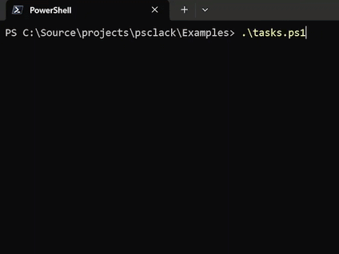

<p align="center">
  
</p>

<h1 align="center">PsClack</h1>

<p align="center">
  Clack-inspired terminal prompts and UI components for PowerShell 7+.
</p>

<p align="center">
  <a href="https://github.com/koderi-dp/psclack">GitHub</a>
</p>

<p align="center">
  
</p>

`PsClack` provides interactive prompts, spinners, notes, and boxed output with ANSI and plain fallbacks.

Public commands use the `PsClack` noun prefix to avoid collisions with other modules.

## Layout

The module is grouped by feature instead of one file per command.

- `Public/Prompts.ps1`
  Prompt commands such as `Read-PsClackTextPrompt`, `Read-PsClackPasswordPrompt`, `Read-PsClackSelectPrompt`.
- `Public/Autocomplete.ps1`
  Autocomplete commands such as `Read-PsClackAutocompletePrompt` and `Read-PsClackAutocompleteMultiSelectPrompt`.
- `Public/Path.ps1`
  Filesystem path prompt helpers such as `Read-PsClackPathPrompt`.
- `Public/FileSearch.ps1`
  Indexed file search prompts such as `Read-PsClackFileSearchPrompt`.
- `Public/Display.ps1`
  Transcript and display helpers such as `Show-PsClackIntro`, `Show-PsClackNote`, `Show-PsClackBox`, `Show-PsClackOutro`.
- `Public/Activity.ps1`
  Spinner and progress commands such as `Invoke-PsClackWithSpinner`, `Start-PsClackSpinner`, `New-PsClackProgress`.
- `Public/Tasks.ps1`
  Task workflow helpers such as `Invoke-PsClackTasks` and `New-PsClackTaskLog`.
- `Public/Files.ps1`
  File helpers such as `Save-PsClackFile`.

Private internals are grouped into:
- `Private/Components`
- `Private/Renderer`
- `Private/Utils`

`PsClack.psm1` is the module entry point and exports an explicit function list from those grouped source files.

## Quick Start

```powershell
Import-Module .\PsClack.psd1 -Force

Show-PsClackIntro -Message 'create-my-app'

$name = Read-PsClackTextPrompt -Message 'What is your name?' -Placeholder 'Anonymous'
$password = Read-PsClackPasswordPrompt -Message 'Enter a password'
$shouldContinue = Read-PsClackConfirmPrompt -Message 'Do you want to continue?'

if (-not $shouldContinue) {
    Show-PsClackCancel -Message 'Operation cancelled'
    return
}

$projectType = Read-PsClackSelectPrompt -Message 'Pick a project type.' -Options @(
    [pscustomobject]@{ Label = 'TypeScript'; Value = 'ts' }
    [pscustomobject]@{ Label = 'JavaScript'; Value = 'js' }
)

Show-PsClackNote -Title 'Summary' -Message "Name: $name`nProject: $projectType"

Invoke-PsClackWithSpinner -Message 'Installing via npm' -SuccessMessage 'Installed via npm' -ScriptBlock {
    Start-Sleep -Seconds 2
}

Show-PsClackOutro -Message "You're all set!"
```

## Components

Prompts:
- `Read-PsClackTextPrompt`
- `Read-PsClackPasswordPrompt`
- `Read-PsClackConfirmPrompt`
- `Read-PsClackSelectPrompt`
- `Read-PsClackMultiSelectPrompt`
- `Read-PsClackAutocompletePrompt`
- `Read-PsClackAutocompleteMultiSelectPrompt`
- `Read-PsClackPathPrompt`
- `Read-PsClackFileSearchPrompt`

Display and flow:
- `Show-PsClackIntro`
- `Show-PsClackNote`
- `Show-PsClackBox`
- `Show-PsClackOutro`
- `Show-PsClackCancel`
- `Invoke-PsClackTasks`
- `Invoke-PsClackPromptGroup`
- `New-PsClackTaskLog`
- `New-PsClackProgress`

Progress:
- `Invoke-PsClackWithSpinner`
- `Start-PsClackSpinner`
- `Update-PsClackSpinner`
- `Stop-PsClackSpinner`

## Usage Notes

Use `Read-*Prompt` directly for interactive input. Use `Invoke-PsClackWithSpinner` for task-style work; it keeps animation in the foreground and is more reliable than background event-driven updates.

Use `Read-PsClackAutocompletePrompt` and `Read-PsClackAutocompleteMultiSelectPrompt` when the option set is easier to filter than to scan. Use `Read-PsClackPathPrompt` for local path entry with live filesystem suggestions, and `Read-PsClackFileSearchPrompt` when you want to pre-index a directory tree and then fuzzy-filter relative paths.

Live-rendered components such as spinners, progress bars, task logs, and prompt frames assume a mostly stable terminal layout while they are running. Resizing the terminal mid-render, mixing in unrelated writes to the same console line, or writing directly to the host from parallel/background work can break cursor placement, wrapping, or the visible frame state.

For the most reliable output, avoid resizing the terminal during active progress or spinner rendering, and prefer updating the UI through the provided PsClack APIs instead of direct `Write-Host` or other live line mutations while a component owns the frame.

## API Reference

### Read-PsClackTextPrompt
| Property | Type | Default | Description |
| --- | --- | --- | --- |
| Message | string | required | Prompt label shown above the input. |
| Placeholder | string | empty string | Placeholder shown when the value is empty. |
| InitialValue | string | empty string | Initial text value. |
| Validate | scriptblock | none | Returns a validation message for invalid input. |
| NonInteractiveValue | string | none | Headless fallback value for CI or automation. |
| PassThru | switch | false | Returns the full prompt result object. |
| Plain | switch | false | Disables ANSI styling. |

```powershell
$name = Read-PsClackTextPrompt -Message 'Project name' -Placeholder 'my-app'
```

### Read-PsClackPasswordPrompt
| Property | Type | Default | Description |
| --- | --- | --- | --- |
| Message | string | required | Prompt label shown above the password input. |
| Placeholder | string | empty string | Placeholder shown before typing. |
| InitialValue | string | empty string | Initial password value. |
| Mask | string | theme default | Character used to mask typed input. |
| Validate | scriptblock | none | Returns a validation message for invalid input. |
| ClearOnError | switch | false | Clears the typed value after validation failure. |
| NonInteractiveValue | string | none | Headless fallback value. |
| PassThru | switch | false | Returns the full prompt result object. |
| Plain | switch | false | Disables ANSI styling. |

```powershell
$password = Read-PsClackPasswordPrompt -Message 'Enter a password'
```

### Read-PsClackConfirmPrompt
| Property | Type | Default | Description |
| --- | --- | --- | --- |
| Message | string | required | Confirmation question. |
| InitialValue | bool | true | Initially selected choice. |
| NonInteractiveValue | bool? | none | Headless fallback value. |
| PassThru | switch | false | Returns the full prompt result object. |
| Plain | switch | false | Disables ANSI styling. |

```powershell
$confirmed = Read-PsClackConfirmPrompt -Message 'Continue with deployment?'
```

### Read-PsClackSelectPrompt
| Property | Type | Default | Description |
| --- | --- | --- | --- |
| Message | string | required | Prompt label shown above the options. |
| Options | object[] | required | Options with `Label`, `Value`, and optional `Hint`. |
| InitialValue | object | first option | Initially selected option value. |
| MaxItems | int | unlimited | Max visible rows before viewporting. |
| NonInteractiveValue | object | none | Headless fallback value. |
| PassThru | switch | false | Returns the full prompt result object. |
| Plain | switch | false | Disables ANSI styling. |

```powershell
$runtime = Read-PsClackSelectPrompt -Message 'Choose a runtime' -Options @(
    [pscustomobject]@{ Label = 'Node.js'; Value = 'node' }
    [pscustomobject]@{ Label = 'PowerShell'; Value = 'pwsh' }
)
```

### Read-PsClackMultiSelectPrompt
| Property | Type | Default | Description |
| --- | --- | --- | --- |
| Message | string | required | Prompt label shown above the options. |
| Options | object[] | required | Options with `Label` and `Value`. |
| InitialValues | object[] | empty array | Initially selected values. |
| Validate | scriptblock | none | Validates the selected value list. |
| MaxItems | int | unlimited | Max visible rows before viewporting. |
| NonInteractiveValues | object[] | none | Headless fallback values. |
| PassThru | switch | false | Returns the full prompt result object. |
| Plain | switch | false | Disables ANSI styling. |

```powershell
$features = Read-PsClackMultiSelectPrompt -Message 'Select features' -Options @(
    [pscustomobject]@{ Label = 'Linting'; Value = 'lint' }
    [pscustomobject]@{ Label = 'Tests'; Value = 'test' }
    [pscustomobject]@{ Label = 'CI'; Value = 'ci' }
)
```

### Read-PsClackAutocompletePrompt
| Property | Type | Default | Description |
| --- | --- | --- | --- |
| Message | string | required | Prompt label shown above the input. |
| Options | object[] | required | Options with `Label`, `Value`, and optional `Hint` and `Disabled`. |
| InitialValue | object | none | Initially focused option value. |
| InitialUserInput | string | empty string | Initial search text before typing. |
| Placeholder | string | empty string | Placeholder shown when the search input is empty. |
| NonInteractiveValue | object | none | Headless fallback value. |
| MaxItems | int | unlimited | Max visible rows before viewporting. |
| Validate | scriptblock | none | Returns a validation message for invalid input. |
| Filter | scriptblock | default match | Custom search predicate that receives the search text and option. |
| PassThru | switch | false | Returns the full prompt result object. |
| Plain | switch | false | Disables ANSI styling. |

```powershell
$package = Read-PsClackAutocompletePrompt -Message 'Pick a package' -Options @(
    [pscustomobject]@{ Label = 'Pester'; Value = 'Pester' }
    [pscustomobject]@{ Label = 'PSReadLine'; Value = 'PSReadLine' }
    [pscustomobject]@{ Label = 'Az'; Value = 'Az' }
)
```

### Read-PsClackAutocompleteMultiSelectPrompt
| Property | Type | Default | Description |
| --- | --- | --- | --- |
| Message | string | required | Prompt label shown above the input. |
| Options | object[] | required | Options with `Label`, `Value`, and optional `Hint` and `Disabled`. |
| InitialValues | object[] | empty array | Initially selected values. |
| NonInteractiveValues | object[] | none | Headless fallback values. |
| MaxItems | int | unlimited | Max visible rows before viewporting. |
| Validate | scriptblock | none | Validates the selected value list. |
| Filter | scriptblock | default match | Custom search predicate that receives the search text and option. |
| Required | switch | false | Requires at least one selected value. |
| Placeholder | string | empty string | Placeholder shown when the search input is empty. |
| PassThru | switch | false | Returns the full prompt result object. |
| Plain | switch | false | Disables ANSI styling. |

```powershell
$modules = Read-PsClackAutocompleteMultiSelectPrompt -Message 'Select modules' -Options @(
    [pscustomobject]@{ Label = 'Pester'; Value = 'Pester' }
    [pscustomobject]@{ Label = 'PlatyPS'; Value = 'PlatyPS' }
    [pscustomobject]@{ Label = 'PSReadLine'; Value = 'PSReadLine' }
)
```

### Read-PsClackPathPrompt
| Property | Type | Default | Description |
| --- | --- | --- | --- |
| Message | string | required | Prompt label shown above the input. |
| InitialValue | string | current path or `Root` | Starting path shown in the input. |
| Root | string | current working directory | Starting directory used when `InitialValue` is omitted. |
| OnlyDirectories | switch | false | Limits suggestions to directories. |
| MaxItems | int | 5 | Max visible filesystem matches. |
| Validate | scriptblock | none | Returns a validation message for invalid input. |
| NonInteractiveValue | string | none | Headless fallback value. |
| PassThru | switch | false | Returns the full prompt result object. |
| Plain | switch | false | Disables ANSI styling. |

```powershell
$targetPath = Read-PsClackPathPrompt -Message 'Select an output folder' -OnlyDirectories
```

### Read-PsClackFileSearchPrompt
| Property | Type | Default | Description |
| --- | --- | --- | --- |
| Message | string | Search files | Prompt label shown above the search input. |
| Root | string | current working directory | Directory tree to scan before interactive filtering. |
| Filter | string | `*` | Wildcard filter applied during the filesystem scan. |
| Depth | int | unlimited | Optional recursion depth limit. |
| IncludeDirectories | switch | false | Includes directories alongside files in the indexed result set. |
| MaxResults | int | 500 | Maximum entries indexed into the option list. |
| MaxItems | int | 10 | Max visible rows before viewporting. |
| Validate | scriptblock | none | Returns a validation message for invalid input. |
| NonInteractiveValue | string | none | Headless fallback value. |
| PassThru | switch | false | Returns the full prompt result object. |
| Plain | switch | false | Disables ANSI styling. |

```powershell
$scriptFile = Read-PsClackFileSearchPrompt -Root . -Filter '*.ps1' -Message 'Find a script'
```

### Show-PsClackIntro
| Property | Type | Default | Description |
| --- | --- | --- | --- |
| Message | string | required | Inverse-style intro badge text. |
| PassThru | switch | false | Returns rendered lines instead of writing them. |
| Plain | switch | false | Disables ANSI styling. |

```powershell
Show-PsClackIntro -Message 'init-tool'
```

### Show-PsClackNote
| Property | Type | Default | Description |
| --- | --- | --- | --- |
| Title | string | empty string | Note heading rendered in the top border. |
| Message | string | empty string | Note body text. |
| PassThru | switch | false | Returns rendered lines instead of writing them. |
| Plain | switch | false | Disables ANSI styling. |

```powershell
Show-PsClackNote -Title 'Next step' -Message 'Run the build before publishing.'
```

### Show-PsClackBox
| Property | Type | Default | Description |
| --- | --- | --- | --- |
| Title | string | empty string | Box title rendered in the top border. |
| Message | string | empty string | Box body text. Supports multiline content. |
| Rounded | switch | false | Uses rounded border corners. |
| Width | Auto, int, or fraction | Auto | Auto-sizes the box, forces a numeric width, or accepts a fractional terminal width between `0` and `1`. |
| TitlePadding | int | 1 | Horizontal padding around the title text. |
| ContentPadding | int | 2 | Horizontal padding around body content. |
| BorderColor | enum | Gray | Border color. |
| TitleColor | enum | Default | Title text color. |
| TextColor | enum | Default | Body text color. |
| ContentAlign | Left, Center, or Right | Left | Body text alignment. |
| TitleAlign | Left, Center, or Right | Left | Title alignment. |
| PassThru | switch | false | Returns rendered lines instead of writing them. |
| Plain | switch | false | Disables ANSI styling. |

```powershell
Show-PsClackBox -Title 'Summary' -Message "Name: demo`nStatus: ready" -Rounded
```

### Show-PsClackOutro
| Property | Type | Default | Description |
| --- | --- | --- | --- |
| Message | string | required | Final transcript line. |
| Status | Success, Info, Cancel, or Error | Success | Controls styling and guide behavior. |
| PassThru | switch | false | Returns rendered lines instead of writing them. |
| Plain | switch | false | Disables ANSI styling. |

```powershell
Show-PsClackOutro -Message 'Project created successfully.'
```

### Show-PsClackCancel
| Property | Type | Default | Description |
| --- | --- | --- | --- |
| Message | string | required | Cancel closeout message. |
| PassThru | switch | false | Returns rendered lines instead of writing them. |
| Plain | switch | false | Disables ANSI styling. |

```powershell
Show-PsClackCancel -Message 'Operation cancelled by user.'
```

### Invoke-PsClackPromptGroup
| Property | Type | Default | Description |
| --- | --- | --- | --- |
| ScriptBlock | scriptblock | required | Runs a grouped prompt flow and returns a combined result. |
| PassThru | switch | false | Wraps the group result in a prompt result object. |

```powershell
$result = Invoke-PsClackPromptGroup {
    @{
        Name = Read-PsClackTextPrompt -Message 'Project name'
        Confirmed = Read-PsClackConfirmPrompt -Message 'Create project now?'
    }
}
```

### Invoke-PsClackTasks
| Property | Type | Default | Description |
| --- | --- | --- | --- |
| Tasks | object[] | required | Sequential task list with `Title`, `Task`, and optional `Enabled`, `SuccessMessage`, `ErrorMessage`. |
| ContinueTranscript | switch | false | Adds transcript spacing before the first task. |
| PassThru | switch | false | Returns task result objects. |
| Plain | switch | false | Disables ANSI styling. |

```powershell
Invoke-PsClackTasks -Tasks @(
    @{ Title = 'Restore packages'; Task = { Start-Sleep -Milliseconds 300 } }
    @{ Title = 'Run tests'; Task = { Start-Sleep -Milliseconds 300 } }
)
```

### Invoke-PsClackWithSpinner
| Property | Type | Default | Description |
| --- | --- | --- | --- |
| Message | string | required | Spinner message while work is running. |
| ScriptBlock | scriptblock | required | Work executed in a background job. |
| SuccessMessage | string | Message | Final success line. |
| CancelMessage | string | Operation cancelled | Final cancel line. |
| ErrorMessage | string | exception message | Final error line. |
| Frames | string[] | theme default | Custom spinner frames. |
| IntervalMs | int? | theme default | Spinner tick interval. |
| ContinueTranscript | switch | false | Adds spacing for transcript continuation. |
| Plain | switch | false | Disables ANSI styling. |

```powershell
Invoke-PsClackWithSpinner -Message 'Installing dependencies' -SuccessMessage 'Install complete' -ScriptBlock {
    Start-Sleep -Seconds 2
}
```

### New-PsClackTaskLog
| Property | Type | Default | Description |
| --- | --- | --- | --- |
| Title | string | required | Task log title shown in the header. |
| Limit | int | 0 | Max visible log lines per buffer. `0` means unlimited. |
| Spacing | int | 1 | Empty guide lines after the title. |
| RetainLog | switch | false | Retains trimmed log lines for later display. |
| Plain | switch | false | Disables ANSI styling. |
| Return value | log object | n/a | Supports `.Message()`, `.Group()`, `.Success()`, `.Error()`. |

```powershell
$log = New-PsClackTaskLog -Title 'Build output'
$log.Message('Restoring modules...')
$log.Success('Build completed')
```

### New-PsClackProgress
| Property | Type | Default | Description |
| --- | --- | --- | --- |
| Style | Light, Heavy, or Block | Heavy | Progress bar glyph style. |
| Max | int | 100 | Max progress value. |
| Size | int | 40 | Width of the bar body. |
| MinSize | int | 12 | Minimum bar width when the renderer shrinks the bar to fit the terminal. |
| ContinueTranscript | switch | false | Adds transcript spacing before the bar. |
| Plain | switch | false | Disables ANSI styling. |
| Return value | progress object | n/a | Supports `.Start()`, `.Advance()`, `.Message()`, `.Tick()`, `.Wait()`, `.Stop()`, `.Cancel()`, `.Error()`. |

```powershell
$progress = New-PsClackProgress -Max 3
$progress.Start('Processing files')
1..3 | ForEach-Object {
    Start-Sleep -Milliseconds 300
    $progress.Advance("Completed item $_")
}
$progress.Stop('Done')
```

### Save-PsClackFile
| Property | Type | Default | Description |
| --- | --- | --- | --- |
| Uri | uri | required | File URL to download. |
| Path | string | temp file | Destination path. If omitted, a temp file is created. |
| TimeoutSeconds | int | 1800 | Request and read/write timeout. |
| Overwrite | switch | false | Allows replacing an existing destination file. |
| ChunkSizeBytes | int | 1MB | Read size per stream iteration. |
| ProgressIntervalMilliseconds | int | 100 | Minimum callback interval for `ProgressAction`. |
| StartedAction | scriptblock | none | Called once with initial download state. |
| ProgressChangedAction | scriptblock | none | Called during download with updated state. |
| CompletedAction | scriptblock | none | Called once with final state. |
| FailedAction | scriptblock | none | Called on failure with exception and partial state. |

```powershell
Save-PsClackFile -Uri 'https://example.com/archive.zip' -Path "$pwd\archive.zip" -Overwrite
```

The download callback state includes `SourceFileName`, `BytesDownloaded`, `ContentLength`, `Percent`, `ElapsedSeconds`, and `BytesPerSecond` so callers can render their own progress UI.

### Start-PsClackSpinner
| Property | Type | Default | Description |
| --- | --- | --- | --- |
| Message | string | required | Spinner message while running. |
| Frames | string[] | theme default | Custom spinner frames. |
| IntervalMs | int | theme default | Spinner tick interval. |
| ContinueTranscript | switch | false | Adds transcript spacer behavior. |
| NoAutoSpin | switch | false | Disables timer/event auto-spin. |
| Plain | switch | false | Disables ANSI styling. |

```powershell
$spinner = Start-PsClackSpinner -Message 'Waiting for background work'
```

### Update-PsClackSpinner
| Property | Type | Default | Description |
| --- | --- | --- | --- |
| Spinner | pscustomobject | required | Spinner object returned by `Start-PsClackSpinner`. |

```powershell
Update-PsClackSpinner -Spinner $spinner
```

### Stop-PsClackSpinner
| Property | Type | Default | Description |
| --- | --- | --- | --- |
| Spinner | pscustomobject | required | Spinner object returned by `Start-PsClackSpinner`. |
| Status | Success, Cancelled, or Error | Success | Final spinner state. |
| Message | string | spinner message | Final message override. |

```powershell
Stop-PsClackSpinner -Spinner $spinner -Status Success -Message 'Background work finished'
```

## Examples

Run the example launcher:

```powershell
pwsh .\Examples\index.ps1
```

Useful scripts:
- `Examples\basic-flow.ps1`
- `Examples\autocomplete.ps1`
- `Examples\path.ps1`
- `Examples\file-search.ps1`
- `Examples\clack-demo.ps1`
- `Examples\clack-demo.snapshot.ps1`
- `Examples\download.ps1`
- `Examples\prompt-group.ps1`
- `Examples\non-interactive.ps1`
- `Examples\password.ps1`
- `Examples\note.ps1`
- `Examples\box.ps1`
- `Examples\tasks.ps1`
- `Examples\task-log.ps1`
- `Examples\progress.ps1`
- `Examples\spinner.ps1`
- `Examples\select-viewport.ps1`
- `Examples\multiselect-viewport.ps1`
- `Examples\wrapped-prompts.ps1`
- `Examples\wrapped-spinner.ps1`
- `Examples\error-state.ps1`

## Testing

```powershell
pwsh .\Tests\Run.ps1
```

Current suite status:
- Pester coverage for public API, renderer snapshots, and state transitions

## Status

Implemented:
- prompts
- autocomplete prompts
- filesystem path prompt
- indexed file search prompt
- spinner workflow
- sequential task workflow
- buffered task log workflow
- progress bar workflow
- note and box display components
- wrapping and viewporting
- non-interactive fallbacks
